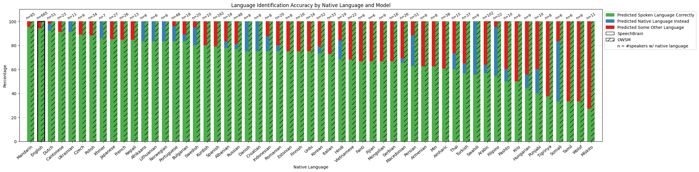

# Spoken Language Identification Evaluation on Speech Accent Archive 

[Speech Accent Archive (SAA)](https://accent.gmu.edu/) contains a bunch of samples of accented English speech. We evaluate two popular spoken language identification models to see how good they are at recognizing English across accents: [Speechbrain](https://huggingface.co/speechbrain/lang-id-voxlingua107-ecapa) and [OWSM](https://arxiv.org/abs/2401.16658).

## Results
Check `progress.csv` for the raw results and `plots/` for figures stratified by demographics. In short, the language identification accuracy of Speechbrain significantly varies by accent (with best performance for more "mainstream"/widely-spoken variants of English) whereas OWSM does well across accents.

## How to Run This Yourself
0. Download the contents of the `language-identification` folder.
1. [Download SAA](https://www.kaggle.com/datasets/rtatman/speech-accent-archive?resource=download) and unzip the contents into the `archive` subfolder.
2. Make sure you have [Python 3.9 or higher installed](https://www.python.org/downloads/) and install the dependencies `pip install -r requirements.txt`.
3. Then run the `Eval.ipynb` notebook to run evaluation and recreate the figures.

If you want to run language identification on different datasets/files, take a look at `OWSM.py` and `Speechbrain.py`.
